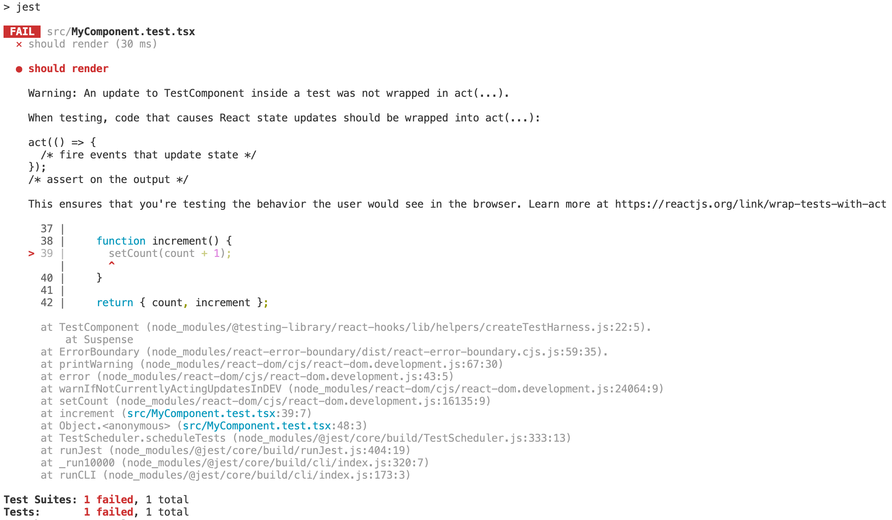
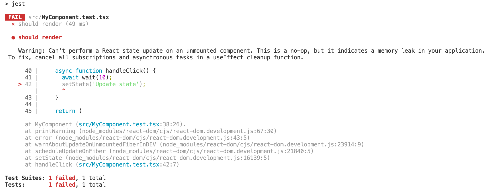

# throw-on

[](https://www.npmjs.com/package/throw-on)
[](https://github.com/tkrotoff/throw-on/actions)
[](https://codeclimate.com/github/tkrotoff/throw-on/test_coverage)
[](https://bundlephobia.com/result?p=throw-on)
[](https://github.com/prettier/prettier)
[](https://github.com/airbnb/javascript)

Force console.error and network requests to fail.

- Tiny: less than 100 lines of code
- No dependencies
- Fully tested
- Written in TypeScript
- Works with Node.js and browsers
- Generic: not specific to React

## Why?

Do you have warnings like _"An update inside a test was not wrapped in act"_ or _"Can't perform a React state update on an unmounted component"_ when running your React app?

Are your tests performing network requests when they shouldn't?

Solution: throw whenever there is a React warning (e.g. console.error) or a network request that isn't mocked.

- The sooner a test fails, the easier it is to fix it
- Improve the quality of your code (like an ESLint rule but at runtime)

Result:

- before (test passes)

  

  

- after (test fails)

  

  

## Usage

### In your tests

`npm install --save-dev throw-on`

```TypeScript
// Inside jest.setup.js (Jest setupFilesAfterEnv option) for example
import {
  throwOnConsole,
  throwOnFetch,
  throwOnXMLHttpRequestOpen
} from 'throw-on';

throwOnConsole('assert');
throwOnConsole('error');
throwOnConsole('warn');
throwOnFetch();
throwOnXMLHttpRequestOpen();
```

### In the browser

`npm install throw-on`

```TypeScript
// Inside your entry file (something like index.js or app.js)
import { throwOnConsole } from 'throw-on';

if (process.env.NODE_ENV !== 'production') { // You probably don't want this in production
  throwOnConsole('assert');
  throwOnConsole('error');
  throwOnConsole('warn');
}
```

### Make it your own

Copy-paste [throwOnConsole.ts](src/throwOnConsole.ts) and/or [throwOnFetch.ts](src/throwOnFetch.ts) and/or [throwOnXMLHttpRequestOpen.ts](src/throwOnXMLHttpRequestOpen.ts) into your source code.

### Platform support

Requires Node.js >= 15 or a [String.replaceAll](https://developer.mozilla.org/en-US/docs/Web/JavaScript/Reference/Global_Objects/String/replaceAll) [polyfill](https://github.com/zloirock/core-js#stringreplaceall).

Transpilation to ES5 (via Babel for example) is needed for non-modern browsers.

## API

```TypeScript
type Options = {
  /**
   * Messages to ignore (won't throw), each message to ignore can be a substring or a regex.
   *
   * Empty list by default.
   */
  ignore?: (string | RegExp)[];

  /**
   * Displays the full stack trace including the 'throwError()' part if true; this helps for debugging.
   * Works only under V8.
   *
   * False by default.
   */
  fullStackTrace?: boolean;
};

type ConsoleMethodName = 'assert' | 'error' | 'warn' | 'info' | 'log' | 'dir' | 'debug';

/**
 * Makes console method to throw if called.
 */
function throwOnConsole(methodName: ConsoleMethodName, options: Options = {}): void;

/**
 * Restores the original console method implementation.
 */
function restoreConsole(methodName: ConsoleMethodName): void;

/**
 * Makes fetch to throw if called.
 */
function throwOnFetch(): void;

/**
 * Restores the original fetch implementation.
 */
function restoreFetch(): void;

/**
 * Makes XMLHttpRequest.open to throw if called.
 */
function throwOnXMLHttpRequestOpen(): void;

/**
 * Restores the original XMLHttpRequest.open implementation.
 */
function restoreXMLHttpRequestOpen(): void;
```

## Limitations

When using the `ignore` option, the stack trace displayed by Jest includes an extra line corresponding to throw-on source code.
I did not find a solution, here is an attempt: https://github.com/tkrotoff/throw-on/pull/1
