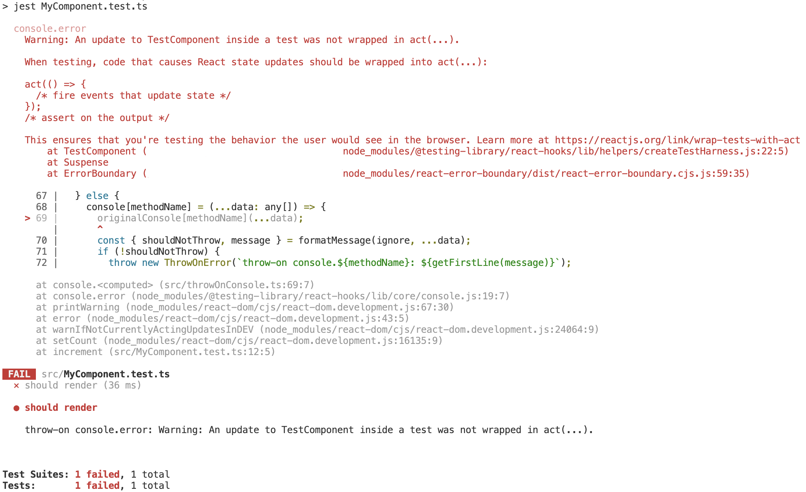

# throw-on

[](https://www.npmjs.com/package/throw-on)
[](https://github.com/tkrotoff/throw-on/actions)
[](https://codeclimate.com/github/tkrotoff/throw-on/test_coverage)
[](https://bundlephobia.com/result?p=throw-on)
[](https://github.com/prettier/prettier)
[](https://github.com/airbnb/javascript)

Force console.error/warn and network requests to fail.

- Tiny: less than 100 lines of code
- No dependencies
- Fully tested
- Written in TypeScript
- Works with Node.js and browsers
- Generic: not specific to React or Jest

This is an alternative to https://github.com/ValentinH/jest-fail-on-console

## Why?

Do you have warnings like _"An update inside a test was not wrapped in act"_ or _"Can't perform a React state update on an unmounted component"_ when running or testing your React app? Are your tests performing network requests when they shouldn't?

Solution: throw whenever there is a warning (e.g. console.error/warn) or a network request that isn't mocked

- The sooner a test fails, the easier it is to fix
- Improve code quality (like an ESLint rule but at run/test time)

throw-on still displays the original console message before throwing an exception with the message `throw-on console.[METHOD]: [ORIGINAL_MESSAGE_SHORTEN]`

Result:

- before (test passes)

  

- after (test fails)

  

## Usage

### In your tests

`npm install --save-dev throw-on`

```TypeScript
// Inside jest.setup.js (Jest setupFilesAfterEnv option) for example

import {
  throwOnConsole,
  throwOnFetch,
  throwOnXMLHttpRequestOpen
} from 'throw-on';

throwOnConsole('assert');
throwOnConsole('error');
throwOnConsole('warn');
throwOnFetch();
throwOnXMLHttpRequestOpen();
```

### In the browser

`npm install throw-on`

```TypeScript
// Inside your entry file (something like index.js, app.js, pages/_app.js)

if (process.env.NODE_ENV !== 'production') { // You probably don't want this in production
  const { throwOnConsole } = await import('throw-on');
  throwOnConsole('assert');
  throwOnConsole('error');
  throwOnConsole('warn');
}

render(<MyApp />, document.getElementById('app'));
```

### Make it your own

Copy-paste [throwOnConsole.ts](src/throwOnConsole.ts) and/or [throwOnFetch.ts](src/throwOnFetch.ts) and/or [throwOnXMLHttpRequestOpen.ts](src/throwOnXMLHttpRequestOpen.ts) into your source code.

### Platform support

Tested with Node.js >= 14, might work with Node.js 12.

Transpilation to ES5 (via Babel for example) is needed for non-modern browsers.

## API

```TypeScript
type Options = {
  /**
   * Messages to ignore (won't throw), each message to ignore can be a substring or a regex.
   *
   * Empty list by default.
   */
  ignore?: (string | RegExp)[];
};

type ConsoleMethodName = 'assert' | 'error' | 'warn' | 'info' | 'log' | 'dir' | 'debug';

/**
 * Makes console method to throw if called.
 */
function throwOnConsole(methodName: ConsoleMethodName, options: Options = {}): void;

/**
 * Restores the original console method implementation.
 */
function restoreConsole(methodName: ConsoleMethodName): void;

/**
 * Makes fetch to throw if called.
 */
function throwOnFetch(): void;

/**
 * Restores the original fetch implementation.
 */
function restoreFetch(): void;

/**
 * Makes XMLHttpRequest.open to throw if called.
 */
function throwOnXMLHttpRequestOpen(): void;

/**
 * Restores the original XMLHttpRequest.open implementation.
 */
function restoreXMLHttpRequestOpen(): void;
```

## What about valid console messages?

If a `console.error()` is expected, then you should assert for it:

```TypeScript
test('should log an error', () => {
  const spy = jest.spyOn(console, 'error').mockImplementation();

  // ...

  expect(spy).toHaveBeenCalledTimes(1);
  expect(spy).toHaveBeenCalledWith('your error message');

  spy.mockRestore();
});
```

## Limitations

- Be careful: it adds a line to Jest stack trace, messing up the [codeframe](https://github.com/facebook/jest/issues/8819):

  ```
  at console.<computed> (src/throwOnConsole.ts:69:7) <===
  at console.error (node_modules/@testing-library/react-hooks/lib/core/console.js:19:7)
  at printWarning (node_modules/react-dom/cjs/react-dom.development.js:67:30)
  at error (node_modules/react-dom/cjs/react-dom.development.js:43:5)
  ...
  ```

  Use `restoreConsole()` to get the original codeframe

- Be careful: the shorten exception message does not always match the original console message (because of [React error boundary](https://reactjs.org/docs/error-boundaries.html)?)

- Libraries that console.\* exceptions <sup>[1](https://github.com/expressjs/express/blob/4.17.3/lib/application.js#L630)</sup> <sup>[2](https://github.com/expressjs/api-error-handler/blob/1.0.0/index.js#L22)</sup> introduce an infinite loop:
  throw-on intercepts the console.\* call and throws an exception => the library catches the exception and console.\* it, ect.
