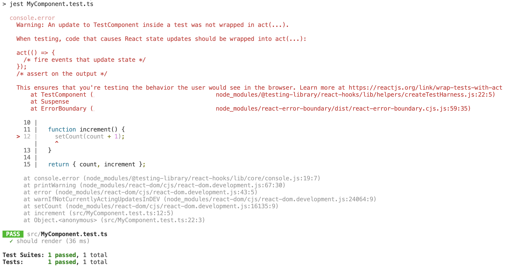

# throw-on

[](https://www.npmjs.com/package/throw-on)
[](https://github.com/tkrotoff/throw-on/actions)
[](https://codeclimate.com/github/tkrotoff/throw-on/test_coverage)
[](https://bundlephobia.com/result?p=throw-on)
[](https://github.com/prettier/prettier)
[](https://github.com/airbnb/javascript)

Force console.error and network requests to fail.

- Tiny: less than 100 lines of code
- No dependencies
- Fully tested
- Written in TypeScript

## Why?

Do you have warnings like _"An update inside a test was not wrapped in act"_ or _"Can't perform a React state update on an unmounted component"_ when running your React app tests?

Are your tests performing network requests when they shouldn't?

Solution: throw whenever there is a React warning (e.g. console.error) or a network request that isn't mocked.

- The sooner a test fails, the easier it is to fix it
- Improve the quality of your code (like an ESLint rule but at runtime)

Result:

- before (test passes)

  

  

- after (test fails)

  

  

## Usage

`npm install --save-dev throw-on`

```TypeScript
// Inside jest.setup.js for example
import {
  throwOnConsoleAssert,
  throwOnConsoleError,
  throwOnConsoleWarn,
  throwOnFetch
} from 'throw-on';

throwOnConsoleAssert();
throwOnConsoleError();
throwOnConsoleWarn();
throwOnFetch();
```

Or copy-paste [throwOnConsole](src/throwOnConsole.ts) and/or [throwOnFetch](src/throwOnFetch.ts) into your source code.

Requires Node.js >= 15 or a [String.replaceAll](https://developer.mozilla.org/en-US/docs/Web/JavaScript/Reference/Global_Objects/String/replaceAll) [polyfill](https://github.com/zloirock/core-js#stringreplaceall).
